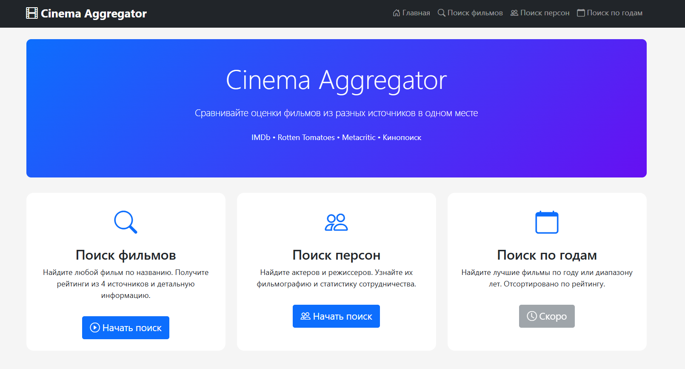
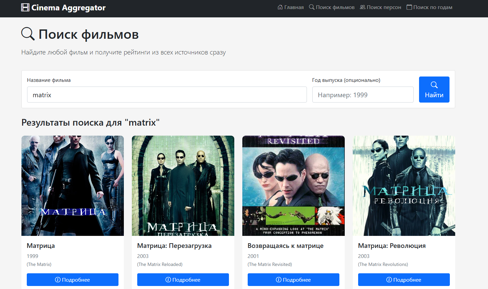
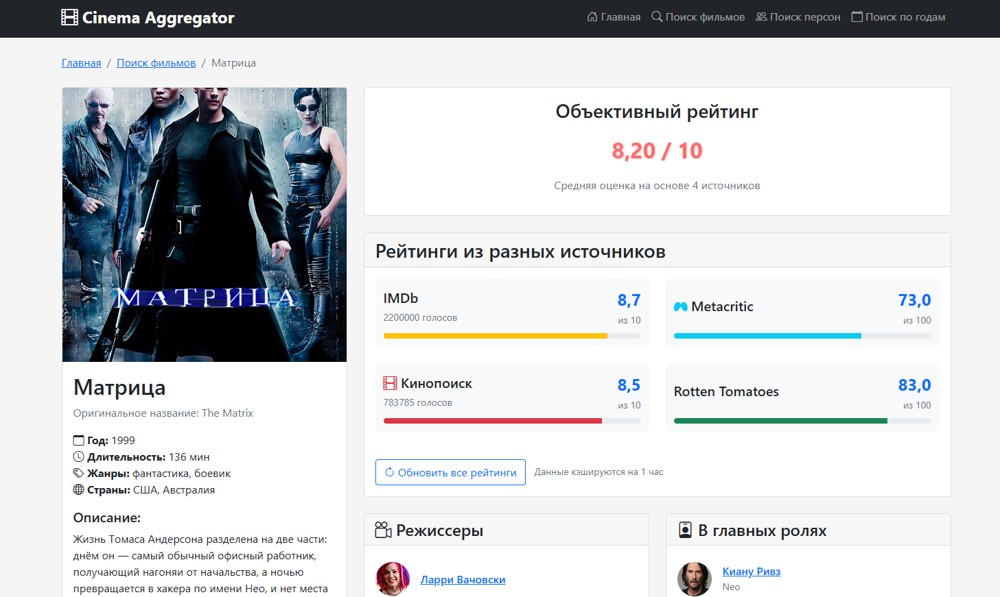
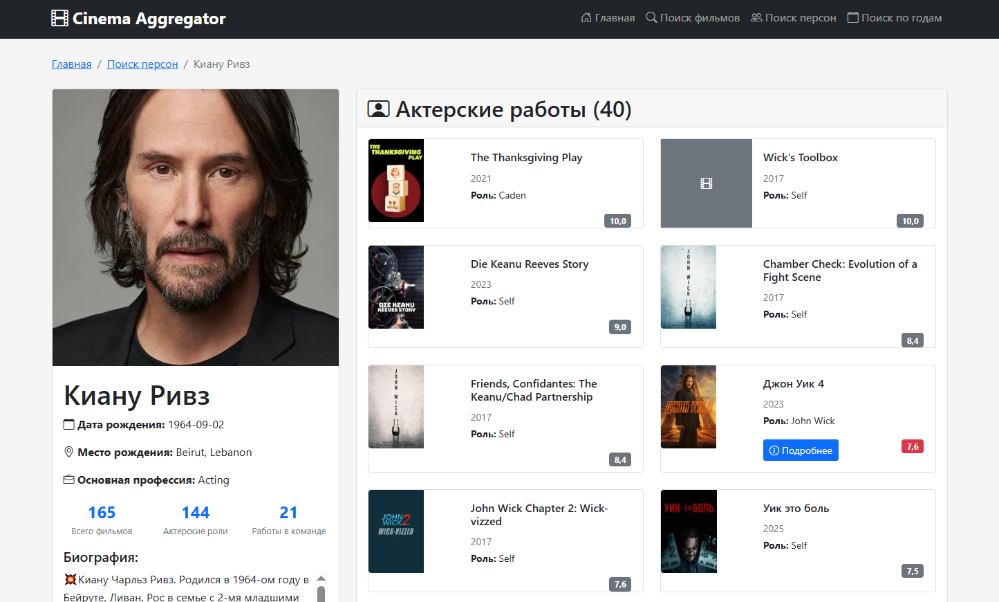

# CinemaAggregator

Веб-сервис для киноманов, который агрегирует оценки фильмов из четырёх авторитетных источников (IMDb, Rotten Tomatoes, Metacritic, Кинопоиск) и формирует комплексные рейтинги. Сервис решает проблему необходимости ручного сравнения оценок с разных платформ, предоставляя пользователям единую точку для объективного анализа кинокартин.

**Ссылка на рабочий проект:** [https://mudwin.pythonanywhere.com](https://mudwin.pythonanywhere.com)

## Технологии

* **Python 3.10+**
* **Django 4.x**
* **Django REST Framework**
* **Celery** + **Redis** (для асинхронных задач)
* **Requests** (для работы с внешними API)
* **SQLite** (разработка)
* **HTMX** + **Alpine.js** (динамический интерфейс)
* **Django CORS Headers**
* **Django Filter**

## Скриншоты

### Главная страница

*Главная страница с поиском по фильмам и персонам*

### Страница поиска

*Страница поиска по фильмам с выводом результатов*

### Страница фильма

*Детальная страница фильма с агрегированными рейтингами из 4 источников*

### Страница персоны

*Страница актера/режиссера с фильмографией, отсортированной по рейтингу*

## Функциональность

### ✅ Реализовано:
- **Поиск фильмов** по названию с использованием TMDB API
- **Детальная страница фильма** с отображением рейтингов из:
  - IMDb
  - Rotten Tomatoes
  - Metacritic
  - Кинопоиск
- **Кликабельные ссылки** на актеров и режиссеров
- **Поиск персон** (актеры, режиссеры)
- **Страница персоны** с фильмографией, отсортированной по комплексному рейтингу
- **Асинхронное обновление данных** через Celery задачи
- **Кэширование** запросов к внешним API
- **Адаптивный дизайн**

### 🔄 В разработке:
- Поиск по годам/диапазонам лет
- Статистика совместной работы персон
- Топ-фильмы по годам

## Как запустить проект локально

### 1. Клонируйте репозиторий
```bash
git clone https://github.com/yourusername/cinema-aggregator.git
cd cinema-aggregator
```

### 2. Создайте виртуальное окружение
```bash
python -m venv venv

# Для Linux/Mac:
source venv/bin/activate

# Для Windows:
venv\Scripts\activate
```

### 3. Установите зависимости
```bash
pip install -r requirements.txt
```

### 4. Настройте переменные окружения

Создайте файл `.env` в корне проекта:

```bash
TMDB_API_KEY=ваш_ключ_tmdb
OMDB_API_KEY=ваш_ключ_omdb
KINOPOISK_API_KEY=ваш_ключ_kinopoisk
SECRET_KEY=django-secret-key-сюда
DEBUG=True
CELERY_BROKER_URL=redis://localhost:6379/0
```

### 5. Выполните миграции
```bash
python manage.py migrate
```

### 6. Запустите Redis (для Celery)
```bash
# Ubuntu/Debian:
sudo systemctl start redis

# Или через Docker:
docker run -d -p 6379:6379 redis:alpine
```

### 7. Запустите Celery worker
```bash
celery -A cinema_aggregator worker --loglevel=info
```

### 8. Запустите сервер разработки
```
python manage.py runserver
```

### 9. Откройте в браузере

Перейдите по адресу: [http://127.0.0.1:8000/](http://127.0.0.1:8000/)

## Архитектура проекта

```
cinema_aggregator/
├── core/                    # Основное приложение
│   ├── services/           # Сервисный слой для работы с API
│   │   ├── tmdb_service.py
│   │   ├── omdb_service.py
│   │   ├── kinopoisk_service.py
│   │   └── film_aggregator.py
│   ├── tasks.py           # Celery задачи
│   ├── models.py          # Модели данных
│   └── templates/         # HTML шаблоны
├── cinema_aggregator/      # Настройки проекта
├── media/                 # Загружаемые файлы
└── static/                # Статические файлы
```

## API Ключи

Для работы проекта необходимы API ключи:

1. TMDB API: [developers.themoviedb.org](https://developers.themoviedb.org)
2. OMDb API: [omdbapi.com/apikey.aspx](https://omdbapi.com/apikey.aspx)
3. Kinopoisk API Unofficial: [kinopoiskapiunofficial.tech](kinopoiskapiunofficial.tech)

## Полезные команды

```bash
# Создать суперпользователя
python manage.py createsuperuser

# Запустить тесты
python manage.py test

# Очистить кэш API
python manage.py clear_api_cache

# Загрузить тестовые данные
python manage.py quick_import "Интерстеллар"
```

## Особенности реализации

1. Асинхронная загрузка данных - при первом поиске фильма информация подгружается в фоне через Celery
2. Умное кэширование - результаты запросов к API сохраняются для снижения нагрузки
3. Отказоустойчивость - корректная обработка недоступности отдельных источников рейтингов
4. Динамический интерфейс - использование HTMX для плавных обновлений без перезагрузки страницы

